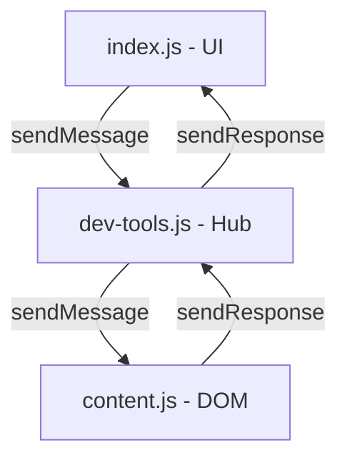

## Arquitetura do Sistema — Trade Manager Core

Este documento alinha o Core com a arquitetura do projeto completo (Trade Manager Pro), mantendo o escopo enxuto e sem duplicações. Referência do projeto completo: `https://github.com/caiomaggiore/trade-manager-pro`.

### 1) Visão Geral (Manifest V3)

- UI (Iframe)
  - Arquivos: `src/layout/index.html`, `src/layout/settings.html`, `src/layout/logs.html`.
  - Scripts carregados no iframe: `src/content/log-sys.js`, `src/content/state-manager.js`, `src/content/index.js`, `src/content/capture-screen.js`.
  - Responsabilidade: interface, eventos, status e exibição de resultados. Sem acesso direto ao DOM da página da Pocket Option.
  - Comunicação interna: `window.postMessage` usando tipos `LOG_MESSAGE` e `UPDATE_STATUS`.

- Content Scripts
  - Arquivo principal: `src/content/content.js`.
  - Responsabilidade: manipulação do DOM da plataforma (quando necessário), ponte entre UI e Background, injeção/controle do iframe na página.
  - Regras: manter aqui apenas operações diretas no DOM; regras de negócio devem ser centralizadas (ver seção dev-tools).

- Background (Service Worker)
  - Arquivo: `src/background/background.js`.
  - Responsabilidade: orquestração, acesso a `chrome.storage`, notificações e integrações que não dependem do DOM.
  - Captura de tela: `chrome.tabs.captureVisibleTab` exposta via mensageria.

Diagrama simplificado do fluxo:

```mermaid
graph TD
  subgraph UI (Iframe)
    A[index.html] --> B[index.js]
  end

  subgraph Content
    C[content.js]
  end

  subgraph Background
    D[background.js]
  end

  B -- chrome.runtime.sendMessage --> C
  B -- chrome.runtime.sendMessage --> D
  C -- Ações no DOM --> G[Página Pocket Option]
  C -- Mensagens --> D
```

### 2) Padrões de Comunicação

- Interno do iframe: `window.postMessage({ type: 'LOG_MESSAGE' | 'UPDATE_STATUS', data })`.
- Entre contextos (UI/Content/Background): `chrome.runtime.sendMessage({ action, ...payload })` e `chrome.runtime.onMessage.addListener`.
- Evitar “Message Port Closed”: sempre retornar `true` de forma síncrona quando a resposta for assíncrona.

Exemplo de listener correto:

```javascript
chrome.runtime.onMessage.addListener((message, sender, sendResponse) => {
  if (message.action === 'CAPTURE_SCREENSHOT') {
    (async () => {
      try {
        const dataUrl = await captureVisibleTab();
        sendResponse({ success: true, dataUrl });
      } catch (error) {
        sendResponse({ success: false, error: error.message });
      }
    })();
    return true; // Mantém a porta aberta para resposta assíncrona
  }
});
```

### 3) Sistema Global de Logs e Status (Iframe)

- Funções globais disponíveis no iframe:
  - `window.sendLog(message, level = 'INFO', source = 'SYSTEM')`
  - `window.sendStatus(message, type = 'info', duration = 3000)`
- Responsabilidades:
  - `log-sys.js`: recebe e processa `LOG_MESSAGE`.
  - `index.js`: recebe e processa `UPDATE_STATUS`.

Formato das mensagens:

```javascript
// Log
window.postMessage({ type: 'LOG_MESSAGE', data: { message, level: 'INFO', source: 'CORE' } }, '*');

// Status
window.postMessage({ type: 'UPDATE_STATUS', data: { message, type: 'success', duration: 3000 } }, '*');
```

### 4) Padrão UI (Controle Centralizado de Elementos)

Cada arquivo que manipula UI no iframe deve declarar um objeto `UI` no topo, com os elementos relevantes e verificações de existência.

```javascript
const UI = {
  analyzeBtn: document.getElementById('analyzeBtn'),
  captureBtn: document.getElementById('captureBtn'),
  status: document.getElementById('dev-status'),
  result: document.getElementById('analysis-debug-result')
};

if (UI.analyzeBtn) {
  UI.analyzeBtn.addEventListener('click', () => window.sendStatus('Iniciando análise...', 'info'));
}
```

Vantagens: centralização, depuração simples, consistência, e menor acoplamento.

### 5) Arquitetura de Funcionalidades (Hub)

Para eliminar duplicações e organizar regras de negócio:

- `dev-tools.js` (Hub Central): concentra as funcionalidades principais (capturas, análises, coordenação de automação). Expõe operações via `chrome.runtime.sendMessage`.
- `content.js` (DOM Specialist): apenas operações diretas no DOM e respostas a requisições específicas do Hub.
- `index.js` (UI Controller): eventos, atualização de status, e delegação de ações ao Hub.

Fluxo típico:



Observação: no Core, o Hub pode ser introduzido gradualmente. Enquanto não existir `dev-tools.js`, a coordenação mínima fica em `index.js` e `content.js`.

### 6) Clipboard em MV3 (Offscreen)

- Não usar `navigator.clipboard.writeText()` em offscreen (foco inexistente).
- Padrão robusto: `chrome.offscreen` + `document.execCommand('copy')` em documento offscreen.
- Respeitar CSP: scripts sempre em arquivos `.js` (sem inline em HTML do offscreen).

### 7) Versionamento e Publicação

1. Atualizar `version` no `manifest.json` (SemVer: MAJOR.MINOR.PATCH).
2. Commit das alterações.
3. Criar tag anotada correspondente à versão do `manifest.json`.
4. Push de branch e tags para o remoto.

```bash
git add .
git commit -m "feat: nova funcionalidade XYZ"
git tag -a v1.0.0 -m "Version 1.0.0"
git push origin master --tags
```

### 8) Estrutura Atual do Core (viva)

- `src/background/background.js`
- `src/content/content.js`
- `src/content/index.js`
- `src/content/log-sys.js`
- `src/content/state-manager.js`
- `src/content/capture-screen.js`
- `src/layout/index.html`, `src/layout/settings.html`, `src/layout/logs.html`
- `src/assets/styles/style.css`

Obs.: o `manifest.json` do Core deve referenciar apenas arquivos existentes. Novas entradas só após os arquivos existirem.

### 9) Roadmap (alinhado aos docs)

Prioridade Alta:
- `payout-controller.js`
  - `getCurrentPayout()` com captura robusta no DOM e logs
  - `checkPayoutBeforeAnalysis()` com políticas `wait` e `switch`
- `asset-manager.js`
  - `listAssets()` | `switchTo(asset)` | `switchToBest(minPayout)`
  - Integração com o payout-controller
- Painel Dev (`index.html` + binds em `index.js`)
  - Botões: dimensões do gráfico, crop do gráfico, teste de payout, listar/trocar ativo
  - Exibir status/logs no painel

Mensageria (actions):
- `CAPTURE_SCREENSHOT` (pronto)
- `GET_CURRENT_PAYOUT`
- `LIST_ASSETS`, `SWITCH_ASSET`, `SWITCH_BEST_ASSET`
- Garantir `return true` para respostas assíncronas

### 10) Definition of Done (Core)

- Extensão carrega sem erros (MV3)
- Iframe injeta e toggle funciona
- `sendStatus` atualiza a área de status
- Captura de tela retorna `dataUrl` válida
- Payout capturado ou fallback informado com log
- Listagem e troca de ativo via Painel Dev
- Settings salva/carrega configurações (storage.sync)
- Logs visíveis em `logs.html`


### 11) Guia de Estilo — Base Visual e Layout (Core)

Esta seção consolida os padrões de UI/UX utilizados no Core, alinhados ao projeto original. Toda nova página/feature deve seguir estas regras.

- Tipografia e Títulos
  - Família única: `Montserrat` para títulos e corpo (import local ou via Google Fonts).
  - Títulos de páginas e categorias em UPPERCASE.

- Ícones
  - Sempre usar Font Awesome Classic (ícones sem borda e sem background), coerentes com o significado semântico do elemento.
  - Evitar emojis. Em produção MV3, preferir empacotar localmente os assets do FA (CSS/woff) para respeitar CSP. Durante desenvolvimento, pode-se referenciar o CDN, mas o alvo é local.

- Cabeçalho (Header)
  - Altura mínima: 56px, sticky no topo.
  - Botões do menu circulares (`.btn.menu`) com 38x38 px, `border-radius: 50%` e ícones Font Awesome (`fa-cog`, `fa-list`, `fa-times`, etc.).

- Containers
  - `main-panel`: fundo com leve gradiente, borda dupla (2px), `border-radius: 12px`, sombra suave e descrição opcional abaixo do título.
  - `sub-panel`: `border-radius: 8px`, borda 1px, sombra leve; header interno com ícone FA e linha divisória inferior.
  - Utilitários de grid: `panel-grid-2`, `panel-grid-3` e itens `panel-item` (par label/valor) com `panel-item-label` e `panel-item-value`.

- Subpáginas (Logs/Config)
  - Overlay transparente; subpágina ocupa 100% da área útil do painel.
  - O footer do index é sempre visível: a shell da subpágina ajusta o `bottom` conforme a altura real do footer.
  - Header das subpáginas segue o mesmo padrão do index (56px, uppercase, botão fechar circular com FA `fa-times`).

- Footer
  - 2 linhas centralizadas: linha 1 = status (pill), linha 2 = versão do `manifest`.
  - O conteúdo das subpáginas deve ter `padding-bottom` suficiente para não cobrir o footer.

- Status (pill)
  - Cores suaves para `info`, `success` e `error`; texto curto e objetivo.

- Botões
  - Classes padronizadas: `.btn` com tamanhos `.sm | .md | .lg`, variantes `.primary` e `.secondary`.
  - Apenas botões possuem hover/focus/active; containers não.

- Formulários (Configurações)
  - Estrutura sem `<form>`: usar `<div>` por consistência com o projeto original.
  - Grid de labels/inputs: 2 colunas (150px | 1fr), `gap: 10px`.
  - Altura de inputs: ~34px; foco com `outline` visível.
  - Labels à esquerda (uppercase), inputs à direita. Ações alinhadas à direita (`.actions-right`).

- CSP e Assets
  - Sem scripts inline; todos os scripts em arquivos `.js` dedicados.
  - Para ícones, preferir empacotar FA localmente para produção MV3 (evita bloqueios CSP). CDN pode ser usado como atalho apenas durante desenvolvimento.

